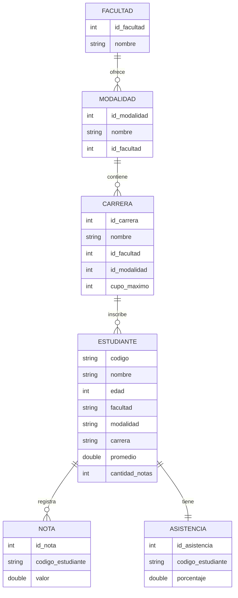

# Diagrama Entidad-Relacion

Sistema Integrador de Gestion Academica Inteligente - UNICAES

## Relaciones

- Una facultad puede ofrecer varias modalidades.
- Una modalidad puede contener varias carreras.
- Una carrera puede inscribir varios estudiantes.
- Cada carrera tiene un cupo maximo de 50 estudiantes.
- Un estudiante puede registrar varias notas.
- Un estudiante tiene un porcentaje de asistencia.
- El promedio academico se calcula usando las notas registradas.
- Un estudiante aprueba por notas si su promedio es mayor o igual a 6.
- Un estudiante aprueba por asistencia si su asistencia es mayor o igual a 75%.
