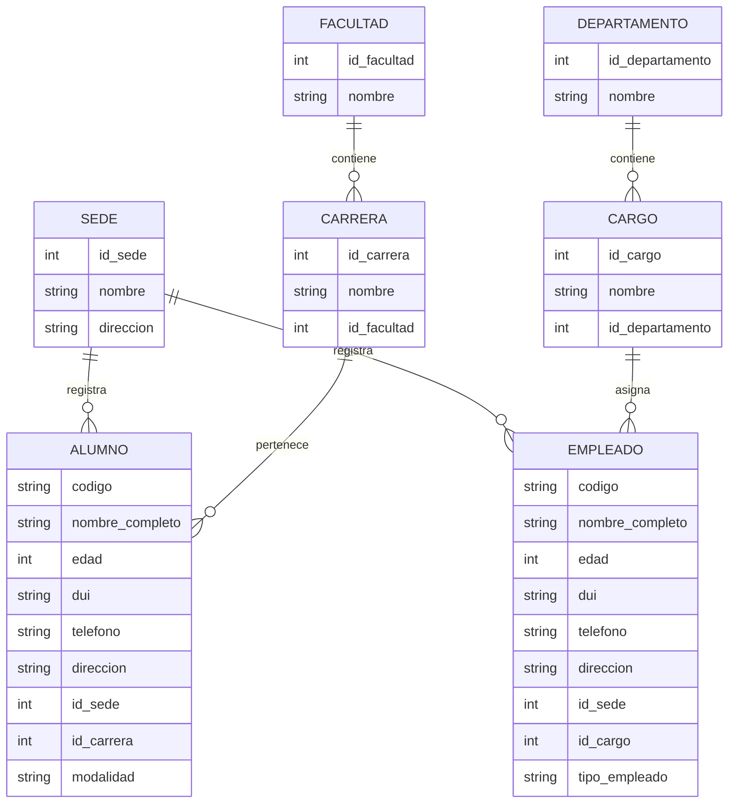
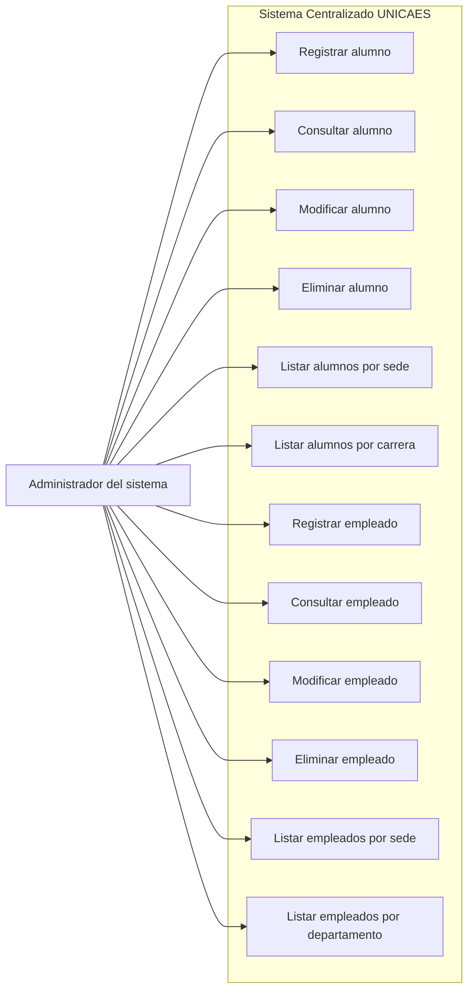

# Diagramas del Sistema Centralizado UNICAES

Sistema para administrar alumnos y empleados de la Universidad Catolica de El Salvador, considerando las sedes de Santa Ana e Ilobasco.

## Diagrama Entidad-Relacion

## Diagrama de Casos de Uso

## Resumen del sistema

- El administrador del sistema es el unico actor.
- El sistema permite administrar alumnos y empleados.
- Cada alumno pertenece a una sede y a una carrera.
- Cada carrera pertenece a una facultad.
- Cada empleado pertenece a una sede y tiene un cargo.
- Cada cargo pertenece a un departamento.
- Las sedes principales son Santa Ana e Ilobasco.
